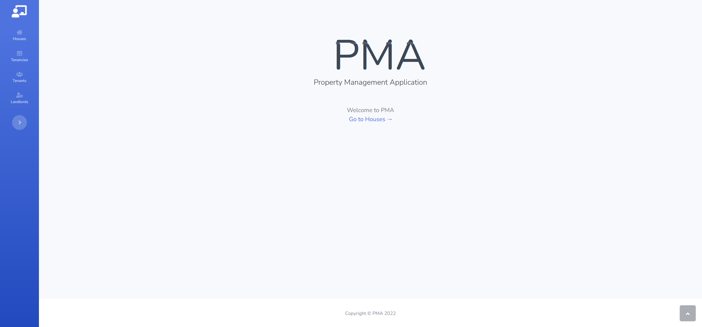
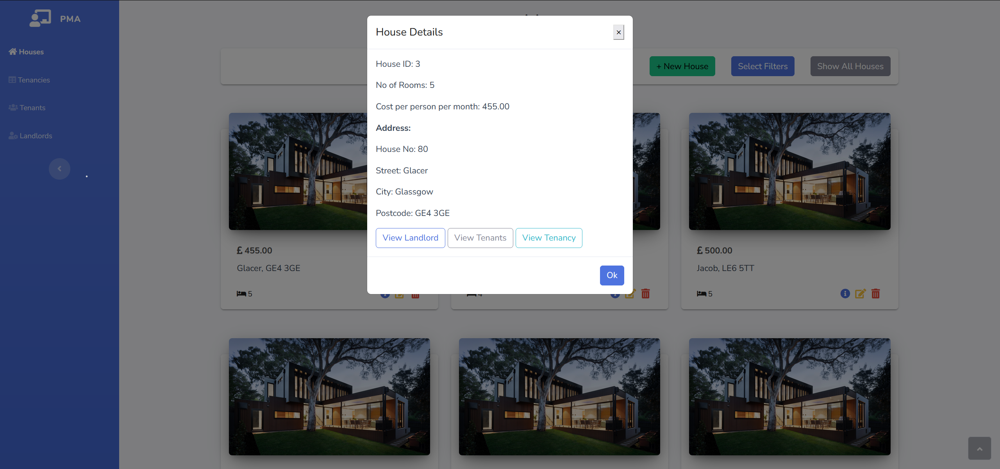
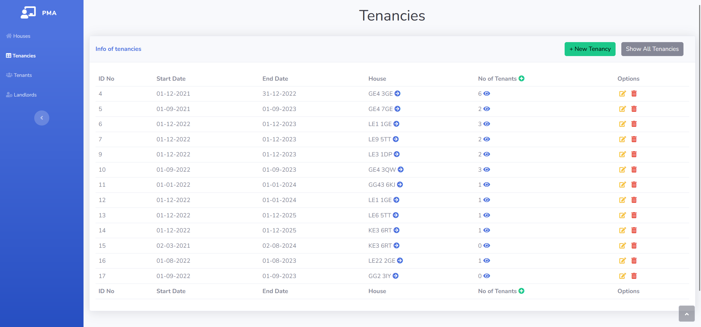
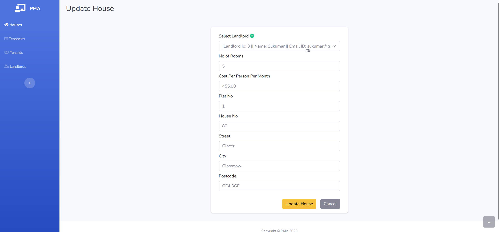
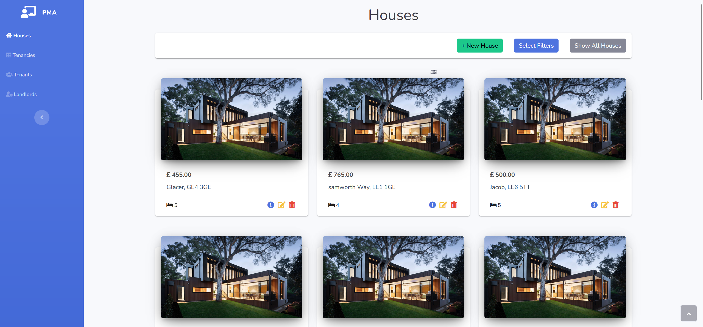
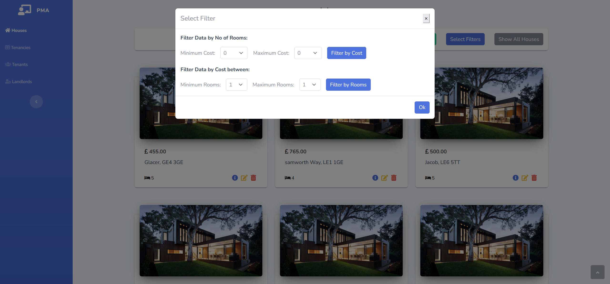
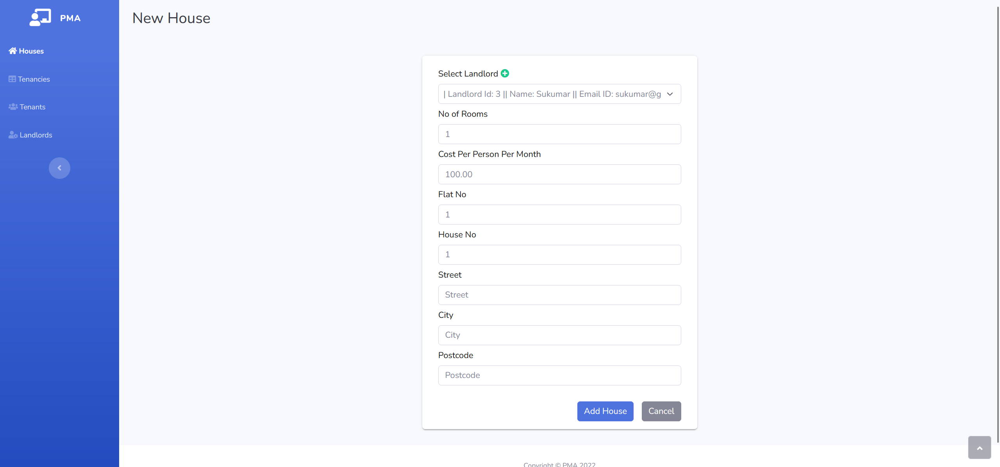
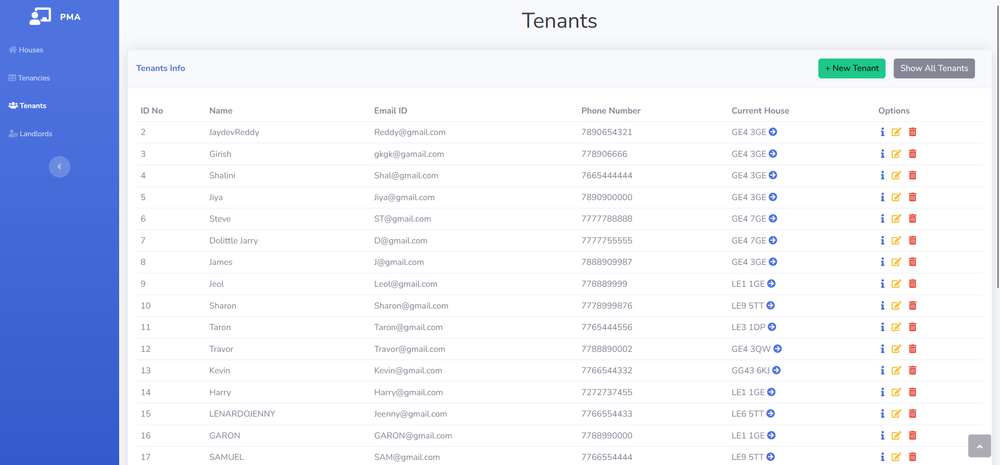
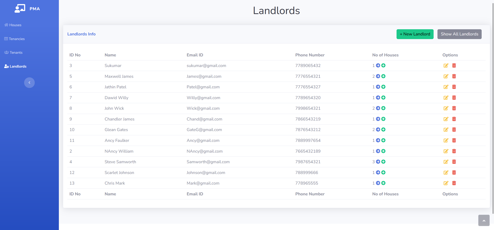

# PropertyManagementApplication

Developed using Java Spring boot, prostgresql, thymleaf

## How to run

## Method 1

**As I had already hosted the application on herokuYou can access the live demo version of the app at https://pma3120.herokuapp.com/**

## Method 2

### Using Localhost

First unzip the project source folder

#### Requires Java11 and set your default system home java path to it

### 1. Setup Postgresql

1. Download and Install postgresql and set it up
2. Run the given sql script that can be found in the project folder (`pma.sql`)
3. Add the values of datasource url, username and password in `application.properties` which can be found in `src/main/resources/application.properties`
4. The default values are given below
   1. `spring.datasource.url= jdbc:postgresql://localhost:5432/pma`
   2. `spring.datasource.username= postgres`
   3. `spring.datasource.password= default`

### 2. Install Apache Maven

### 3. Steps to run

1. Build the project using
   `mvn clean install`
2. Run using `mvn spring-boot:run`
3. Run the test cases using `mvn test`
4. The web application is accessible via http://localhost:8883
5. You can also change the port if it conflicts in `application.properties` which can be found in `src/main/resources/application.properties`
   1. Just change it in `server.port = 8883`

### You can also run it in sts ,intellij or eclipse

### Screenshots

---

---

---

---

---

---

---

---

---
